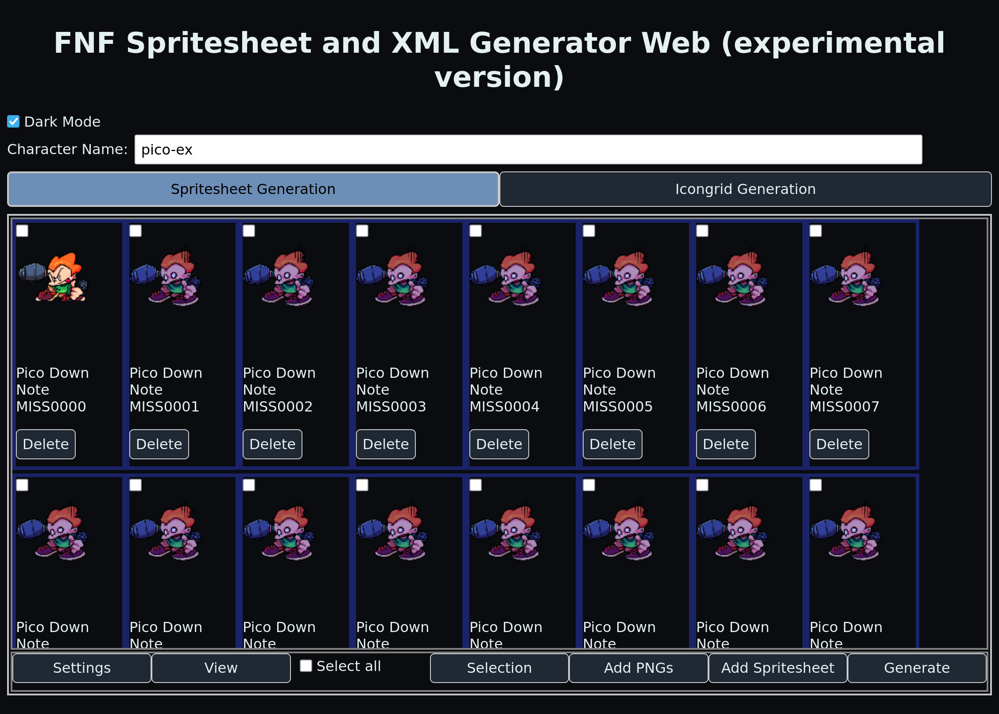

# Tools

This page lists useful tools for Codename Engine modding: as in, this includes
tools that are good for mod work.

Do note that this is purely from an external perspective. Only separate
programs will be listed.

Pure Codename tools can be found on [the
website](https://codename-engine.com/tools/), and addons or scripts can be
found in [the Discord
server](https://discord.com/servers/codename-engine-860561967383445535).

[//]: # (When adding a tool, you should preferrably do the following:
= Take a screenshot of the tool in question. If it's a native application,
  then use your desktop environment's snapshot tool to take a screenshot
  of the window. Web applications need to either have a screenshot taken
  from the web browser's screenshot tool, if one exists, or have the
  screenshot taken from an extension.
  = An example of the former is KDE Plasma with the Spectacle application. On
    KDE Plasma 6.4, activate Spectacle using the PrintScr key, open the
    "New Screenshot" dropdown, and then select either of the window options,
    whichever one you want to use.
  = An example of the latter is Ablaze Floorp with its screenshot tool.
    Floorp will typically place the screenshot tool in the status bar in the
    bottom left. When selecting which mode to use, choose "Save Full Page."
= Tools should preferrably be FOSS, with the exception of components and
  telemetry, like with VSCode.
= The source code hyperlink text is in the format of:
  `service:owner/repo`
  ...where service is the repository-hosting service, owner is the
  repository owner/organization, and repo is the repository name.
)

## Source Code Editors

### Visual Studio Code

> *The open source AI code editor*

Long for VSCode, **Visual Studio Code** is considered to be the editor with
some of the most support for anything.

#### Features

* Ready Haxe support, through an extension
* Available "Codename Autocomplete" extension for language servers
* Easy interface to work with
* AI Support through GitHub Copilot, for those looking for that feature
* Cross-platform (Windows, macOS, Linux)

#### Caveats

* Telemetry is not configurable at the initial launch of the program,
  making it less private in the beginning
* Some features are not useful for Codename modding
* Not an "out of the way" user experience or interface
* Lacks many productive features
* Can be confused for the "mature" version, Visual Studio
* For some users, too much AI focus

#### Metadata

* **Website**: [code.visualstudio.com](https://code.visualstudio.com/)
* **Source Code**:
  [github:microsoft/vscode](https://github.com/microsoft/vscode)

### Zed

> *The editor for what's next*

Written in [Rust](https://rust-lang.org), **Zed** is a source code editor
focusing on performance and productivity.

#### Features

* Multiple keymaps, such as VSCode, JetBrains, Atom...
* Vim mode for emulating the Vi system, allowing much more productive
  typing and commands
* Strong, universal Git features, such as merge commits, stashing, and
  branching
* High-speed live collaboration
* Toggleable, expandable AI features
* Out-of-the-way user interface
* Expandable panes
* Useful Welcome screen that allows the quick configuration of settings

#### Caveats

* Settings are written in JSONC, making some knowledge of the superset required
* AI features are subscription-based
* People not familiar with Vim may have trouble if they use Vim mode
* Not as many extensions, including a lack of a Codename extension, although
  a Haxe one exists

#### Metadata

* **Website**: [zed.dev](https://zed.dev/)
* **Source Code**:
  [github:zed-industries/zed](https://github.com/zed-industries/zed)

### Helix

> Note: The terminal emulator present in the screenshot is
  [Alacritty](https://alacritty.org/).

> *A post-modern text editor*

A descendant of the Vi system, **Helix** manages to provide modern features,
while excelling and tweaking the Vi system for productivity.

#### Features

* Purely based on Vim, so anyone familiar with it will get a similar feel
* Plenty of shortcuts and aliases from the command palette
* Modal editor where each mode is initiated from a key press, so important
  keybinds can be assigned based on mode and with a lack of modifiers
* Tutorial available via the `:tutor` command or running `hx --tutor`
* Good for configuration, simple editing, and more
* Configured using the [TOML](https://toml.io/en/) file format, allowing
  high readability while being based on INI

#### Caveats

* May be confusing for some users
* No official Haxe support, requiring some configuration, such as installation
  of the [Haxe Tree-sitter
  grammar](https://github.com/vantreeseba/tree-sitter-haxe) and [Haxe language
  server](https://github.com/vshaxe/haxe-language-server)
* Does not include an IDE configuration by default
* No Codename plugin available

#### Metadata

* **Website**: [helix-editor.com](https://helix-editor.com/)
* **Source Code**:
  [github:helix-editor/helix](https://github.com/helix-editor/helix)

## Spritesheet Generators

### Texture Packer EX

> *Fork of Free Texture Packer with added improvements*

Tex-Packer-EX, short for **Texture Packer EX**, is a fork of [Free
Texture Packer](https://free-tex-packer.com/) that adds support for Sparrow
atlases, better internal frame management, and repacking a spritesheet.

#### Features

* Allows splitting and repacking spritesheets to optimize and/or dissect them
* Allows viewing a spritesheet in real time
* Many customization options, including scaling, width, rotation, removing
  identical frames...

#### Caveats

* May be too overwhelming for some users

#### Metadata

* **Website**:
  [kitzsh.github.io/tex-packer-ex](https://kitzsh.github.io/tex-packer-ex/)
* **Source Code**:
  [github:kitzsh/tex-packer-ex](https://github.com/kitzsh/tex-packer-ex)

### UncertainProd's FNF Spritesheet and XML Generator (Web)

> *A web version of the Spritesheet and XML generator. Works entirely
> in-browser, written in JS and Rust/Webassembly*

The **FNF Spritesheet and XML Generator** has been commonly used for smaller
mods. The web version improves upon it by working in the browser.

#### Features

* A clear view of frames
* Allows selecting a prefix for frames
* Has a view for both the XML structure and the animations

#### Caveats

* The user experience may be too overwhelming for most users
* Hasn't been maintained in around a year
* Some features are not suitable for Codename *at all*

#### Metadata

* **Website**:
  [uncertainprod.github.io/FNF-Spritesheet-XML-generator-Web](https://uncertainprod.github.io/FNF-Spritesheet-XML-generator-Web/)
* **Source Code**:
  [github:UncertainProd/FNF-Spritesheet-XML-generator-Web](https://github.com/UncertainProd/FNF-Spritesheet-XML-generator-Web)
